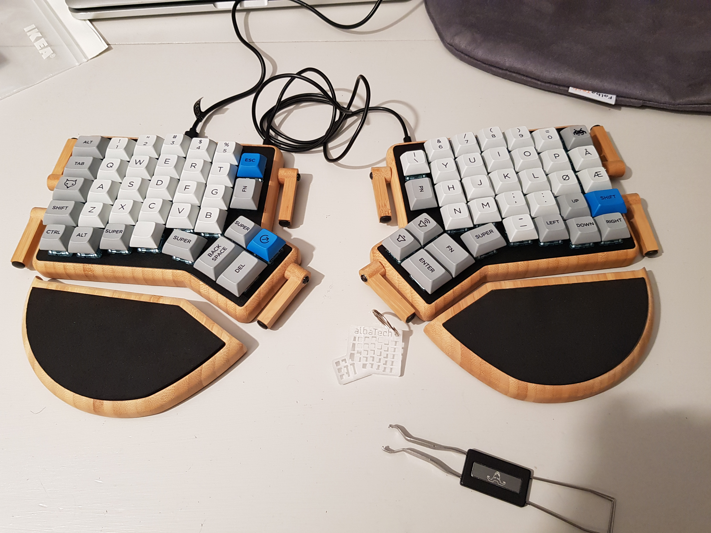

# ReDox

ReDox is a REduced ergoDOX.

This build is ordered and handmade by [falba.tech](www.falba.tech). It has a bamboo case with an aluminum top-plate. It has hot-swap sockets, so if I need/want to switch switches, it can be done without de-soldering.

### How to build

All you need to do is to put in the switches (a little more difficult than with an ergodox, but is possible after some tries). They sit a little skewed, but they are supposed to be like that.

## Pictures of ReDox

